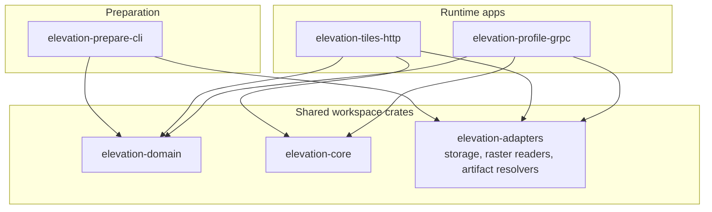

# elevation-kit

`elevation-kit` is set of tools for preparing elevation datasets and serving elevation data over different transports.

## Main idea
`elevation-kit` is composable and extensible workspace.  
Core crates provide shared domain types, query logic and infrastructure adapters, while runnable applications compose these building blocks into different user-facing tools and services.

## GDAL
Most of `elevation-kit` relies on [GDAL](https://gdal.org/) under the hood for raster access and preprocessing. GDAL is used both through Rust bindings and, in some cases, through command-line tools such as `gdalwarp` and `gdal_translate` to reproject datasets, prepare Cloud Optimized GeoTIFFs, and read raster windows efficiently.

