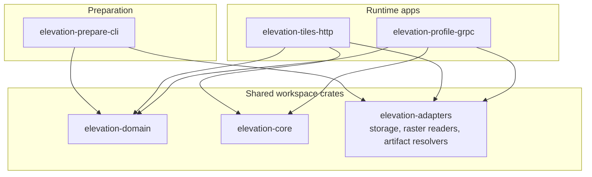

# elevation-kit

`elevation-kit` is set of tools for preparing elevation datasets and serving elevation data over different transports.

## Main idea
`elevation-kit` is composable and extensible workspace.  
Core crates provide shared domain types, query logic and infrastructure adapters, while runnable applications such as `elevation-prepare-cli`, `elevation-tiles-http`, and `elevation-profile-grpc` compose these building blocks into different user-facing tools and services.



Main runnable components at the moment:

- `elevation-prepare-cli` — prepares source datasets and writes metadata
- `elevation-tiles-http` — serves tile-based elevation data over HTTP/SSE
- `elevation-profile-grpc` — serves elevation profiles over gRPC

## GDAL
Most of `elevation-kit` relies on [GDAL](https://gdal.org/) under the hood for raster access and preprocessing. GDAL is used both through Rust bindings and, in some cases, through command-line tools such as `gdalwarp` and `gdal_translate` to reproject datasets, prepare Cloud Optimized GeoTIFFs, and read raster windows efficiently.

## Quick start for elevation-tiles-http as example

This example shows full flow:

1. prepare source GeoTIFF with `elevation-prepare-cli`
2. start `elevation-tiles-http`
3. request tiles from HTTP API

### 1. Prepare dataset

Build CLI image:

```bash
docker build -f elevation-prepare-cli/Dockerfile -t elevation-prepare-cli .
```

Run ingest:

```bash
docker run --rm \
  --user "$(id -u)":"$(id -g)" \
  -v "$(pwd)/data_input:/input:ro" \
  -v "$(pwd)/data:/data" \
  elevation-prepare-cli \
  --source-dataset-path /input/sample.tif \
  --dataset-id sampleid \
  --base-dir /data \
  --registry-name registry
```

After this step, output data directory may look like:

```text
data/
├── sampleid.tif
└── registry.json
```

### 2. Start HTTP service

Build HTTP image:

```bash
docker build -f elevation-tiles-http/Dockerfile -t elevation-tiles-http .
```

Run service:

```bash
docker run --rm \
  -p 3000:3000 \
  --env-file elevation-tiles-http/.env \
  -v "$(pwd)/data:/data" \
  elevation-tiles-http
```

Service uses prepared dataset and metadata from `/data`.

### 3. Request tiles

Get one tile by H3 cell id:

```bash
curl "http://127.0.0.1:3000/tiles/8a1e23fffffffff"
```

Stream tiles for bounding box:

```bash
curl -N "http://127.0.0.1:3000/tiles/stream?min_lon=36.20&min_lat=49.96&max_lon=36.30&max_lat=50.02&zoom=10"
```

### Notes

- Docker examples allows avoid installing GDAL locally.
- Mounted `./data` directory is shared between prepare CLI and HTTP service.
- HTTP service must be configured to use `/data` as its metadata/artifact base directory inside container.

## TODO:
- Add more tests
- Add more benchmarks
- Add discovery mode: app that run in directory or S3 bucket and creates metadata storage based on files
- Add more dataset resolving strategies: only high/low quality 
- Consider using primitives from [geo](https://docs.rs/geo/latest/geo/) library
- Replace intersection processing with proper grid merge algorithm in core
- Implement raster reader without GDAL
