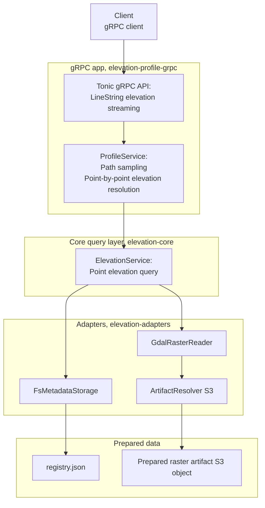

# elevation-profile-grpc

`elevation-profile-grpc` is gRPC service for serving elevation profiles along path.

It is part of `elevation-kit` workspace and uses prepared raster artifacts and metadata produced by `elevation-prepare-cli`.

## What it does

- accepts path as sequence of geographic points
- samples points along that path with configured step
- resolves elevation for each sampled point
- streams resulting profile back over gRPC

## API

Service exposes server-streaming RPC for line string elevation queries.

Client sends path, and server responds with stream of sampled points and their elevation values.

## Configuration

In order to use specific metadata and artifact storage, storage settings should be put in .env file:

- Metadata storage directory
- Metadata registry name

For details see .env.example file.

## Run locally

    cargo run --bin elevation-profile-grpc

## Docker

Build image from workspace root:

    docker build -f elevation-profile-grpc/Dockerfile -t elevation-profile-grpc .

Run it with mounted data directory and environment file:

    docker run --rm \
      -p 50051:50051 \
      --env-file elevation-profile-grpc/.env \
      -v "$(pwd)/data:/data" \
      elevation-profile-grpc

## Example workflow

1. Prepare dataset with `elevation-prepare-cli`
2. Start `elevation-profile-grpc`
3. Connect with gRPC client and request an elevation profile

## Notes

- datasets should be prepared before running service
- profile results are streamed incrementally
- using Docker avoids installing GDAL locally
