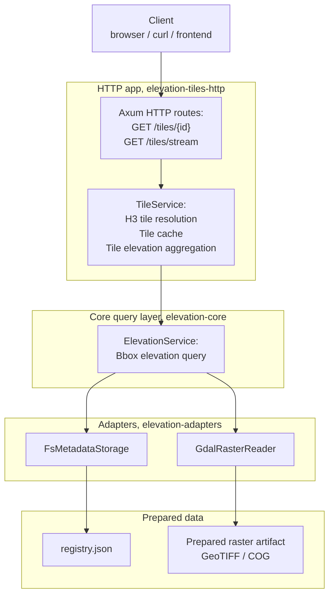

# elevation-tiles-http

`elevation-tiles-http` is an HTTP service for serving tile-based elevation data from prepared datasets.

It is part of `elevation-kit` and uses prepared artifacts and metadata.

## What it does

- resolves H3 tiles for requested area
- computes aggregated tile elevation values
- serves single tile by id
- streams tiles for bounding box over SSE

## Endpoints

### Get tile by id

    GET /tiles/{id}

Returns one tile with its aggregated elevation.

### Stream tiles for bounding box

    GET /tiles/stream?min_lon=...&min_lat=...&max_lon=...&max_lat=...&zoom=...

Streams tile events over Server-Sent Events (SSE).

## Configuration

In order to use specific metadata and artifact storage, storage settings should be put in .env file:

- Metadata storage directory
- Metadata registry name

For details see .env.example file.

## Run locally

    cargo run elevation-tiles-http

## Docker

Build image from workspace root:

    docker build -f elevation-tiles-http/Dockerfile -t elevation-tiles-http .

Run it with mounted data directory and environment file:

    docker run --rm \
      -p 3000:3000 \
      --env-file elevation-tiles-http/.env \
      -v "$(pwd)/data:/data" \
      elevation-tiles-http

## Example requests

Get single tile:

    curl "http://127.0.0.1:3000/tiles/8a1e23fffffffff"

Stream tiles for bounding box:

    curl -N "http://127.0.0.1:3000/tiles/stream?min_lon=36.20&min_lat=49.96&max_lon=36.30&max_lat=50.02&zoom=10"

## Notes

- datasets should be prepared before running service
- SSE responses include tile, error, and done events
- using Docker avoids installing GDAL locally
